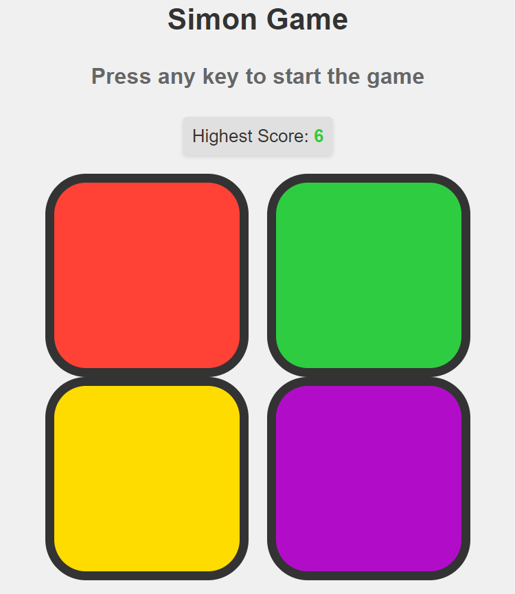

# SimonSays-JS

A modern, web-based take on the classic Simon memory game. Test your recall skills with this sleek, responsive implementation built with vanilla JavaScript, HTML5, and CSS3.

## Description

SimonSays-JS is a digital reimagining of the popular Simon electronic game from the 1980s. The game challenges players with an increasingly complex sequence of lights and sounds, testing and improving memory skills in an engaging, interactive format. With its clean design and smooth gameplay, SimonSays-JS brings this classic game into the modern web era.

## 🎨 Screenshots

Here is a preview of the SimonSays-JS:


## Features

- Classic Simon gameplay with a modern twist
- Responsive design that works on desktop and mobile devices
- Engaging sound and visual feedback
- Progressive difficulty to challenge players of all skill levels
- Highest score tracking that persists across sessions
- Clean, intuitive user interface

## Technologies Used

- HTML5
- CSS3
- JavaScript (ES6+)

## Installation

1. Clone the repository:
   ```
   git clone https://github.com/sudiptadutta99/SimonSays-JS.git
   ```
2. Navigate to the project directory:
   ```
   cd SimonSays-JS
   ```
3. Open `index.html` in your web browser.

## How to Play

1. Press any key to start the game.
2. Watch and listen as the game highlights a button.
3. Click the button that was highlighted.
4. The game will add another step to the sequence.
5. Repeat the sequence by clicking the buttons in the correct order.
6. If you make a mistake, the game will end.
7. Your score is based on the number of rounds you successfully complete.
8. Try to beat your highest score!

## Contributing

Contributions are welcome! Whether it's improving the UI, adding new features, or fixing bugs, feel free to fork the repository and submit a pull request with your changes.

## License

This project is licensed under the MIT License - see the [LICENSE](LICENSE) file for details.

## Acknowledgments

- Inspired by the original Simon game created by Ralph H. Baer and Howard J. Morrison
- Thanks to all contributors who help improve this project

## 👨‍💻 Author

GitHub: [sudiptadutta99](https://github.com/sudiptadutta99)
Twitter: [@sudiptadutta99](https://x.com/sudiptadutta99)

Thanks for checking out my project!
Enjoy the game and happy coding!

